## Jumpstart Generative AI Examples
This repository contains code examples for **SageMaker Jumpstart** Generative AI, a tutorial series designed to help users get started with generative AI using Python and PyTorch.

### AWS Instructor-Led Lab

Follow the instructions given by the workshop administrators on how to log in to the AWS account provided for this workshop. Do NOT use your personal or business account to run this workshop, as the required pre-built resources will not be available and there will be a cost for the compute required to run the Generative Ai models.

## Event Engine AWS Account access

Go to: https://dashboard.eventengine.run/login . You will be redirected to the page below.
 

    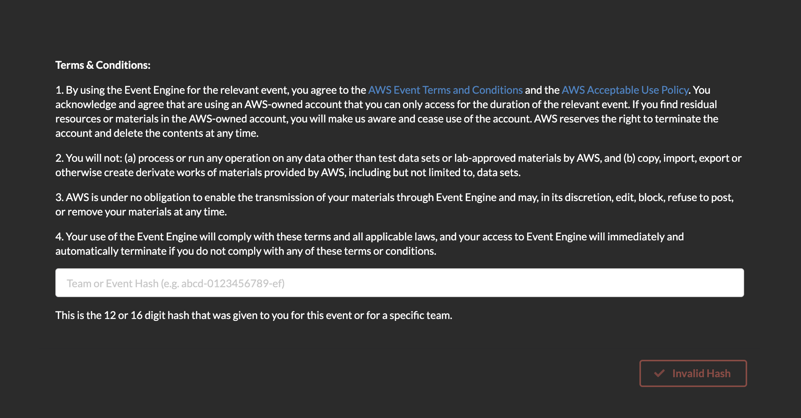

 
Enter the event hash you have received from your instructor.
 

    

 
Click on Email One-Time Password (OTP).
 

    

 
You are redirected to the following page:
 

    

 
Enter your email address and click on Send passcode.
 

    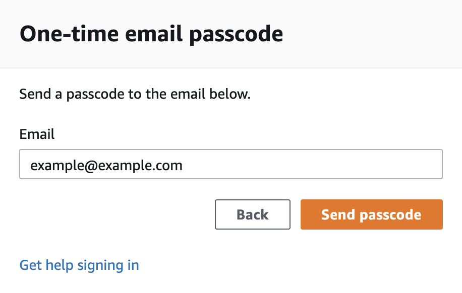

 
You are redirected to the following page:
 

    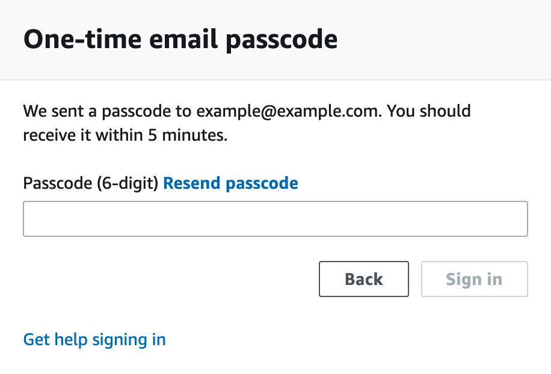

 
Check your mailbox, copy-paste the one-time password and click on Sign in.
 

    

 
You are redirected to the Event Dashboard. Click on "Open AWS Console".
 

    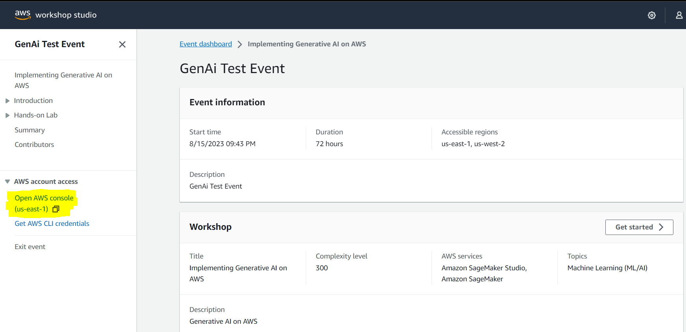

 
You are then redirected to the AWS Console.
 

    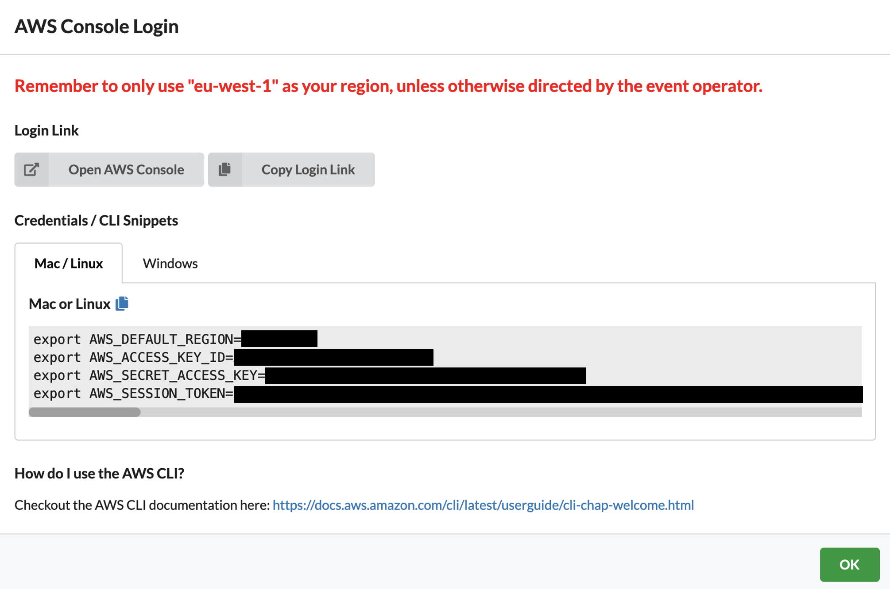

### Amazon SageMaker Studio access

Amazon SageMaker Studio is a web-based, integrated development environment (IDE) for machine learning that lets you build, train, debug, deploy, and monitor your machine learning models. Studio provides all the tools you need to take your models from experimentation to production while boosting your productivity.

If the AWS Account has been provisioned by your AWS Instructor, follow the next steps to access the SageMaker Studio environment:

Open AWS console and switch to AWS region communicated by your instructor.

    

Under services search for Amazon SageMaker.

    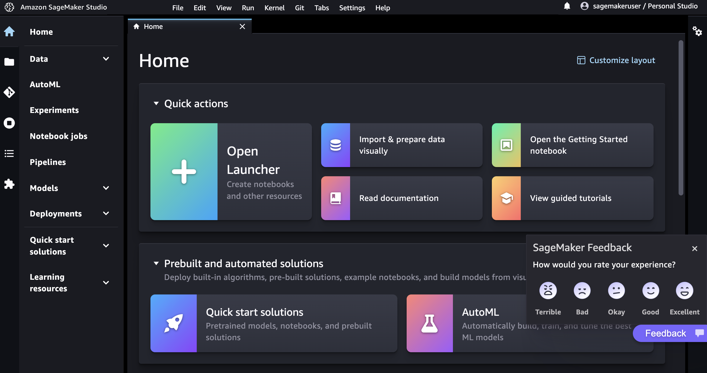

Under Domains, click on the domain name.

    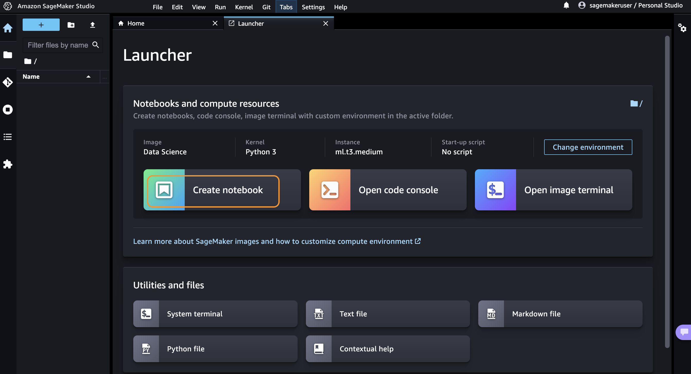

A SageMaker Studio environment should already be provisioned. Click on Launch (on the right side of the preprovisioned sagemakeruser username).

    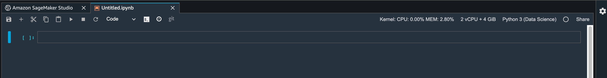

The page can take 1 or 2 minutes to load when you access SageMaker Studio for the first time.

    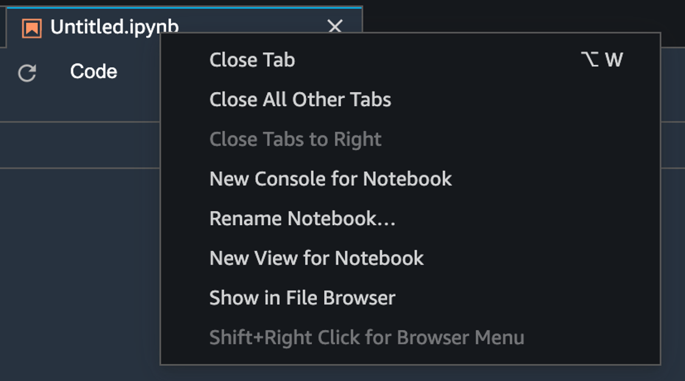

You will be redirected to a new web tab that looks like this:

Click on Open Launcher, and then make sure that the Data Science SageMaker image is selected and click on Create Notebook

### Module 1: Stable Diffusion with Small Dataset of Cat Images
This repository showcases the Stable Diffusion technique, a powerful generative modeling technique that allows for the creation of high-quality images from small datasets. The repository consists of three Jupyter notebooks.

The first notebook, `_Lab 1 - Text to Image.ipynb`, demonstrates how to easily create a SageMaker endpoint for the pre-trained Stable Diffusion model and generate images based on user text prompts. Users can input fun scenarios and prompts to generate various images, such as these cats.

    
    

 
The second notebook, `_Lab 2- Text to Image Inpainting.ipynb`, showcases the process of taking an exsisting image and inpainting.  Inpainting in Generative AI images is the process of filling in missing or corrupted parts of an image.  This will take an original image of a dog and inpaint it with that of a cat.  

The third notebook '_Lab 3 - Finetune a Stable Diffusion Model; showcases the process of fine-tuning the Stable Diffusion model with a small set of images. This approach involves using images of cats from specific breeds or your own pet cats to teach the model how to recreate these images and incorporate them into various creative scenarios. This technique can be adapted to work with any set of images containing fewer than ten examples, such as images of pet dogs or other entities.

By following the steps outlined in the notebook, you can collect a few images of your chosen entity from Google Images and utilize the fine-tuning process to train the Stable Diffusion model to create new and unique compositions. This approach offers a broad range of creative possibilities, allowing you to experiment with various scenarios and unleash your imagination.

    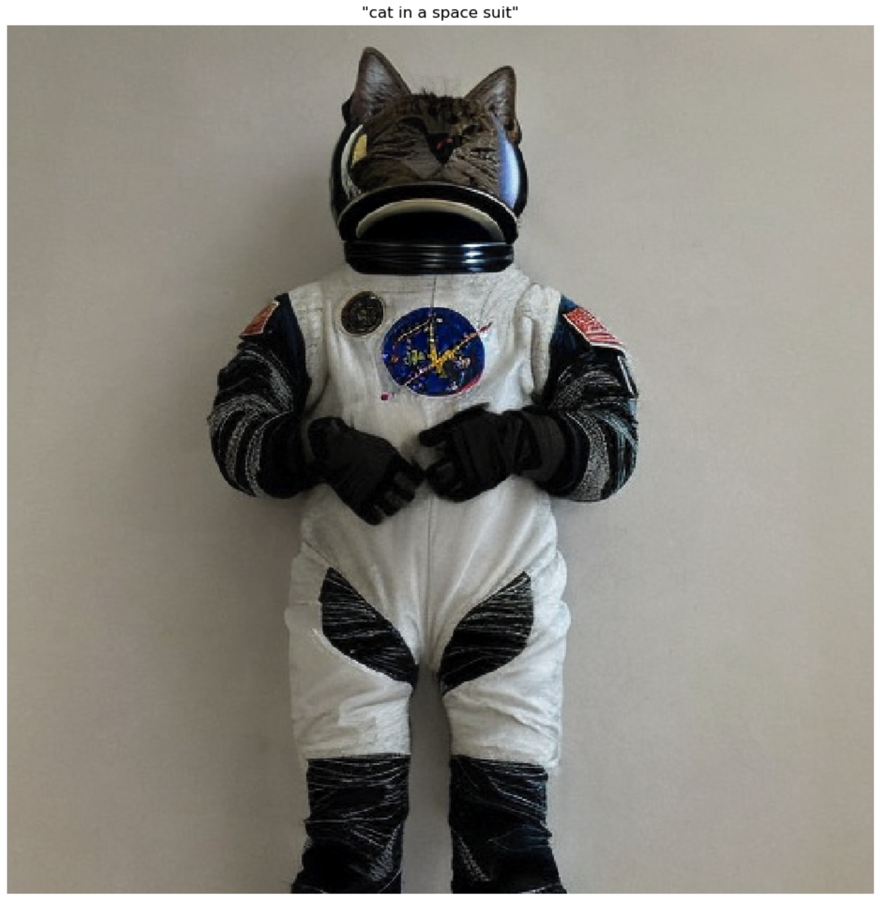
    

This repository provides users with a powerful tool for generating high-quality images, even with limited datasets. The Stable Diffusion technique offers a versatile and efficient way to create customized and imaginative images.

### Module 2: FLAN-T5-XL In-Context Learning via Prompt Engineering
This module focuses on utilizing the FLAN-T5-XL Large Language Model (LLM) to achieve N-shot learning via in-context learning. This involves leveraging the model's natural language understanding (NLU) capabilities to personalize virtual assistant responses and improve their performance for users.

    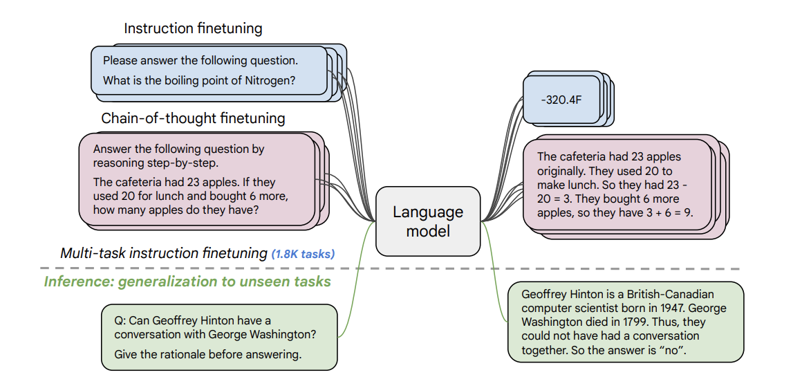

In this module, you will learn step-by-step how to perform NLU tasks using FLAN-T5-XL. Specifically, you will learn how to read and understand multi-turn customer support chat transcripts, and engineer prompts that enable FLAN-T5-XL to learn in-context and improve its performance in N-shot learning. This will enhance the model's ability to infer context and answer questions derived from the chat transcripts.

Overall, this module provides an excellent opportunity to explore the capabilities of FLAN-T5-XL in solving NLU tasks, such as text summarization, abstractive question answering, sentiment analysis, and sentiment phrase extraction.

### Usage
Each module has its own subdirectory containing code examples and instructions for use. Simply navigate to the module you are interested in and follow the instructions in the README file.

### Amazon Internal Reference
This workshop uses :
Workshop ID : 80ae1ed2-f415-4d3d-9eb0-e9118c147bd4 
Repository name : implementing-generative-ai-on-aws
